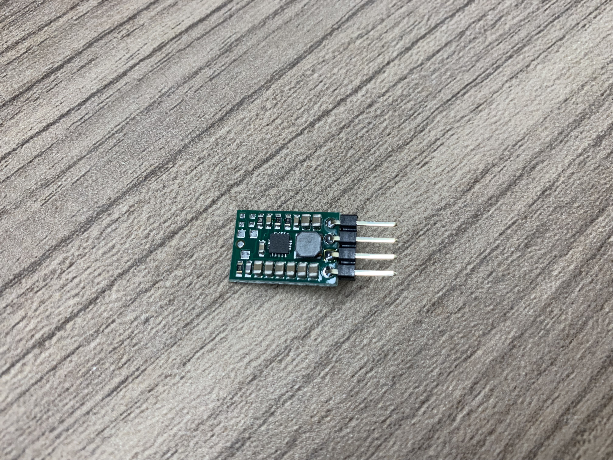
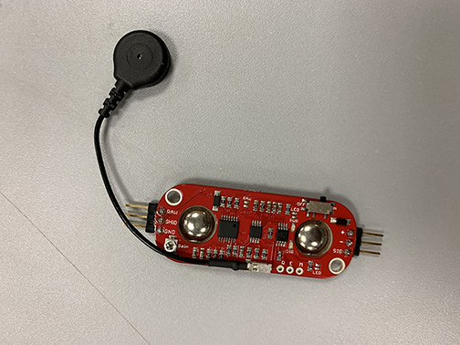
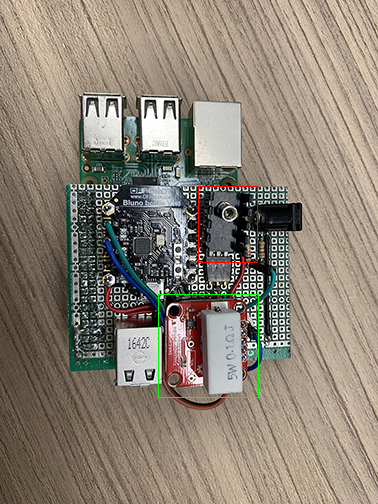

# Hardware Documentation

<!-- Sensor schematic can be found in the `somewhere` folder.   -->
<!-- Circuit design can be found in the `somewhere` folder.   -->

## Hardware Code (Bluno Beetle)
**Note:** Code can be found in the **`Arduino`** folder.  
There are 2 set of freeRTOS code for the Bluno Beetle:  
1. i2c comms code - RPi <--> 1x Bluno Beetle (Fingerprint, Power, EMG)
2. BLE comms code - RPi <--> 6x Bluno Beetle (IMU data - accelerometer + gyrometer)

---

## Hardware Components & Sensors  
| Count | Brand | Type | Purchased from | Remarks |
| --- | --- | --- | --- | --- |
| 6 | ?? | AA Rechargeable Battery | | Borrowed from DSA Lab |
| 1 | - | 6 AA Battery Holder | | Borrowed from DSA Lab |
| 1 | GP ReCyko+ | AA Charger | | Borrowed from DSA Lab |
| 1 | Daiso | Ankle Support | Daiso | |
| 1 | - | Li-Po Charger | SGBotic | |
| 4 | Unicell | 3.7V 150mAh Li-Po Battery | Unicell (Sim Lim Square) | |
| 2 | Unicell | 3.7V 500mAh Li-Po Battery | Unicell (Sim Lim Square) | |
| 10 | DFRobot | Bluno Beetle | DFRobot | |
| 30 | Mitsubishi + others | CR2032 Lithium Coin Cell Battery | Daiso | Cheapest at 2 for $2 |
| 2 | adh-tech | GT-511C1R Fingerprint Sensor | | Borrowed from Prof Peh |
| 1 | Sparkfun | MyoWare EMG Sensor | SGBotic | |
| 14 | - | Biomedical Stickers | SGBotic | |
| 1 | - | EMG Cable | SGBotic | |
| 1 | Raspberry Pi Foundation | Raspberry Pi 3 Model B | | Borrowed from DSA Lab |
| 1 | Samsung | Micro SD Card | | Borrowed from DSA Lab |
| 6 | TDK - InvenSense | MPU-6050 Accel/Gyro Sensor (IMU) | | Borrowed from DSA Lab |
| 1 | - | 5V 3A LDO Regulator | RS Singapore | |
| 6 | Pololu | DC-DC 3.3V 500mA Regulator | SGBotic | |
| 1 | Sparkfun | INA169 Current Sensor | | Borrowed from DSA Lab |
|
---
## Pin Arrangement  
### Raspberry Pi 3 Model B
| S/N | Pin | Remarks |
| --- | --- | --- |
| 1 | GND | Connected to the GND of the circuit |
| 2 | SDA | SDA to Bluno Beetle SDA pin for i2c |
| 3 | SCL | SCL to Bluno Beetle SCL pin for i2c |
| 4 | Micro-USB | Connected to the female USB port of the I/O board for power |
|

### Bluno Beetle (on RPi3 I/O hub)
| S/N | Pin | Remarks |
| --- | --- | --- |
| 1 | VIN | 5V power in from 5V LDO regulator |
| 2 | GND | Connected to the GND of the circuit |
| 3 | SDA | SDA to RPi3 SDA pin for i2c |
| 4 | SCL | SCL to RPi3 SCL pin for i2c |
| 5 | A0 | Measures the battery voltage from the voltage divider circuit |
| 6 | A1 | Measures the circuit current draw from the INA169 current sensor |
| 7 | A2 | Measre the EMG value **(Not implemented)** |
| 8 | D6 | Software Serial for GT-511C1R Fingerprint Sensor **(Not implemented)** |
| 9 | D7 | Software Serial for GT-511C1R Fingerprint Sensor **(Not implemented)** | 
|

### INA169 Current Sensor (on RPi3 I/O hub)
| S/N | Pin | Remarks |
| --- | --- | --- |
| 1 | GND | Connected to the GND of the circuit |
| 2 | VIN+ | Connected to power source positive input |
| 3 | VIN- | Supply power to the rest of the circuit |
| 4 | VOUT | Connected to A1 pin of Bluno Beetle on the I/O hub |
| 5 | VCC | Connected to VIN+ (Shares the same input as VIN+) |
|

### GT-511C1R Fingerprint Sensor (on RPi3 I/O hub)
| S/N | Pin | Remarks |
| --- | --- | --- |
| 1 | Pin 1 - TX | Connected to the Software Serial (RX) pin of Bluno Beetle on I/O hub **(Not implemented)** |
| 2 | Pin 2 - RX | Connect to the Software Serial (TX) pin of Bluno Beetle on I/O hub **(Not implemented)** |
| 3 | Pin 3 - GND | Connect to the GND of the circuit **(Not implemented)** |
| 4 | Pin 4 - VCC (3.3V to 6V) | Connect to the 5V of Bluno Beetle on I/O hub **(Not implemented)** |
|

### MyoWare EMG Sensor
| S/N | Pin | Remarks |
| --- | --- | --- |
| 1 | RAW | Raw EMG Signal **(Not implemented)** |
| 2 | SHID | Shield Power Output **(Not implemented)** |
| 3 | GND | Connect to the GND of the circuit **(Not implemented)** |
| 4 | + | Connect to the 5V of Bluno Beetle on I/O hub **(Not implemented)** |
| 5 | - | Connect to the GND of the circuit **(Not implemented)** |
| 6 | SIG | Connect to pin A2 of Bluno Beetle on I/O hub **(Not implemented)** |
|
`Note:` Connect RAW pin to retrieve the raw EMG signal else, use SIG pin for the rectified EMG signal. Raw EMG signal does not have adjustable gain.

### Bluno Beetle (on dancers hands)
| S/N | Pin | Remarks |
| --- | --- | --- |
| 1 | VIN | Connected to Pololu VOUT pin |
| 2 | 5V | 5V power out to IMU (MPU-6050) |
| 3 | GND | Connected to the GND of the circuit |
| 4 | SDA | SDA to IMU (MPU-6050) for i2c |
| 5 | SCL | SCL to IMU (MPU-6050) for i2c |  
|

### Pololu DC-DC 5V Regulator (on dancers hands)
| S/N | Pin | Remarks |
| --- | --- | --- |
| 1 | SHDN | Not connected (used to be connected to the voltage divider to cut-off power for Li-Po usage|
| 2 | GND | Connected to the GND of the circuit |
| 3 | VIN | Connected to the power source positive input |
| 4 | VOUT | Connected to the VIN of the Bluno Beetle |
|

### IMU (MPU-6050) (on dancers hands)
| S/N | Pin | Remarks |
| --- | --- | --- |
| 1 | GND | Connected to the GND of the circuit |
| 2 | VCC | Connected to the 5V of Bluno Beetle for power |
| 3 | SDA | SDA to Bluno Beetle SDA for i2c |
| 4 | SCL | SCL to Bluno Beetle SCL for i2c |
| 5 | XCA | Not in use |
| 6 | XCL | Not in use |
| 7 | AD0 | Not in use |
| 8 | INT | Not in use |
|

---

## Hardware Setup  
  
**Pololu DC-DC 3.3V 500mA Regulator**

  
**MyoWare EMG**

  
**RPi3 I/O hub**  

---