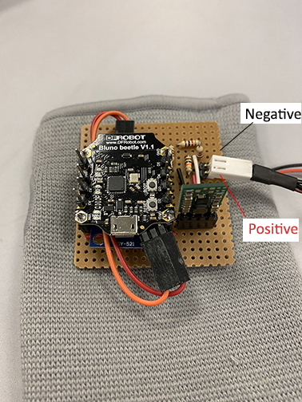

# Hardware Documentation

<!-- Sensor schematic can be found in the `somewhere` folder.   -->
<!-- Circuit design can be found in the `somewhere` folder.   -->

## Hardware Code (Bluno Beetle)
**Note:** Code can be found in the '**`code/arduino`**' folder.  
There are 2 set of freeRTOS code for the Bluno Beetle:  
1. [i2c comms code](./code/freeRTOS/bluno_i2c-io_board/) - RPi <--> 1x Bluno Beetle (Fingerprint, Power, EMG)
2. [BLE comms code](./code/freeRTOS/bluno_mpu6050-hand) - RPi <--> 6x Bluno Beetle (IMU data - accelerometer + gyrometer)  

Individual arduino sensor code can be found in [here](./code/arduino)

---

## Hardware Components & Sensors  
| Count | Brand | Type | Purchased from | Remarks |
| --- | --- | --- | --- | --- |
| 6 | Panasonic eneloop | 1900mAh AA NiMH Rechargeable Battery | - | Borrowed from DSA Lab |
| 1 | - | 6 AA Battery Holder | - | Borrowed from DSA Lab |
| 1 | GP ReCyko+ | AA Charger | - | Borrowed from DSA Lab |
| 1 | Daiso | Ankle Support | Daiso | - |
| 1 | Sparkfun | LiPo Charger Basic | [SGBotic](https://www.sgbotic.com/index.php?dispatch=products.view&product_id=999) | - |
| 4 | Unicell | 3.7V 150mAh LiPo Battery | [Unicell](http://battery.com.sg/) (Sim Lim Square) | - |
| 2 | Unicell | 3.7V 500mAh LiPo Battery | [Unicell](http://battery.com.sg/) (Sim Lim Square) | - |
| 10 | DFRobot | Beetle BLE | [DFRobot](https://www.dfrobot.com/product-1259.html) | - |
| 30 | Mitsubishi + others | CR2032 Lithium Coin Cell Battery | Daiso | Cheapest at 2 for $2 |
| 2 | adh-tech | GT-511C1R Fingerprint Sensor | - | Borrowed from Prof Peh |
| 1 | Sparkfun | MyoWare EMG Sensor | [SGBotic](https://www.sgbotic.com/index.php?dispatch=products.view&product_id=1999) | - |
| 14 | - | Biomedical Sensor Pad | [SGBotic](https://www.sgbotic.com/index.php?dispatch=products.view&product_id=1647) | - |
| 1 | - | Sensor Cable - Electrode Pads | [SGBotic](https://www.sgbotic.com/index.php?dispatch=products.view&product_id=1648) | - |
| 1 | Raspberry Pi Foundation | Raspberry Pi 3 Model B | - | Borrowed from DSA Lab |
| 1 | Samsung | Micro SD Card | - | Borrowed from DSA Lab |
| 6 | TDK - InvenSense | MPU-6050 Accel/Gyro Sensor (IMU) | - | Borrowed from DSA Lab |
| 1 | Texas Instrument | LM1085IT-5.0/NOPB 5V 3A LDO Regulator | [RS Components Singapore](https://sg.rs-online.com/web/p/low-dropout-voltage-regulators/1005917/) | Regulator runs hot during operation. **Do not touch** while in use. |
| 6 | Pololu | S7V8F3 DC-DC 3.3V 1A Regulator | [SGBotic](https://www.sgbotic.com/index.php?dispatch=products.view&product_id=1831) | - |
| 1 | Sparkfun | INA169 Current Sensor | - | Borrowed from DSA Lab |

---

## Pin Arrangement  
### Raspberry Pi 3 Model B
| S/N | Pin | Remarks |
| --- | --- | --- |
| 1 | GND | Connected to the GND of the circuit |
| 2 | SDA | SDA to Bluno Beetle SDA pin for i2c |
| 3 | SCL | SCL to Bluno Beetle SCL pin for i2c |
| 4 | Micro-USB | Connected to the female USB port of the I/O board for power |

### Bluno Beetle (on RPi3 I/O hub)
| S/N | Pin | Remarks |
| --- | --- | --- |
| 1 | VIN | 5V power in from 5V LDO regulator |
| 2 | GND | Connected to the GND of the circuit |
| 3 | SDA | SDA to RPi3 SDA pin for i2c |
| 4 | SCL | SCL to RPi3 SCL pin for i2c |
| 5 | A0 | Read the battery voltage from the voltage divider circuit |
| 6 | A1 | Read the circuit current draw from the INA169 current sensor |
| 7 | A2 | Read the EMG value **(Not implemented)** |
| 8 | D6 | Read Serial for GT-511C1R Fingerprint Sensor **(Not implemented)** |
| 9 | D7 | Read Serial for GT-511C1R Fingerprint Sensor **(Not implemented)** | 

### INA169 Current Sensor (on RPi3 I/O hub)
| S/N | Pin | Remarks |
| --- | --- | --- |
| 1 | GND | Connected to the GND of the circuit |
| 2 | VIN+ | Connected to power source positive input |
| 3 | VIN- | Supply power to the rest of the circuit |
| 4 | VOUT | Connected to A1 pin of Bluno Beetle on the I/O hub |
| 5 | VCC | Connected to VIN+ (Shares the same input as VIN+) |

### GT-511C1R Fingerprint Sensor (on RPi3 I/O hub)
| S/N | Pin | Remarks |
| --- | --- | --- |
| 1 | Pin 1 - TX | Connected to the Software Serial (RX) pin of Bluno Beetle on I/O hub **(Not implemented)** |
| 2 | Pin 2 - RX | Connect to the Software Serial (TX) pin of Bluno Beetle on I/O hub **(Not implemented)** |
| 3 | Pin 3 - GND | Connect to the GND of the circuit **(Not implemented)** |
| 4 | Pin 4 - VCC (3.3V to 6V) | Connect to the 5V of Bluno Beetle on I/O hub **(Not implemented)** |

### MyoWare EMG Sensor
| S/N | Pin | Remarks |
| --- | --- | --- |
| 1 | RAW | Raw EMG Signal **(Not implemented)** |
| 2 | SHID | Shield Power Output **(Not implemented)** |
| 3 | GND | Connect to the GND of the circuit **(Not implemented)** |
| 4 | + | Connect to the 5V of Bluno Beetle on I/O hub **(Not implemented)** |
| 5 | - | Connect to the GND of the circuit **(Not implemented)** |
| 6 | SIG | Connect to pin A2 of Bluno Beetle on I/O hub **(Not implemented)** |

`Note:` Connect RAW pin to retrieve the raw EMG signal else, use SIG pin for the rectified EMG signal. Raw EMG signal does not have adjustable gain.

### Bluno Beetle (on dancers hands)
| S/N | Pin | Remarks |
| --- | --- | --- |
| 1 | VIN | Connected to Pololu VOUT pin |
| 2 | 5V | 5V power out to IMU (MPU-6050) |
| 3 | GND | Connected to the GND of the circuit |
| 4 | SDA | SDA to IMU (MPU-6050) for i2c |
| 5 | SCL | SCL to IMU (MPU-6050) for i2c |  

### Pololu DC-DC 5V Regulator (on dancers hands)
| S/N | Pin | Remarks |
| --- | --- | --- |
| 1 | SHDN | Not connected (used to be connected to the voltage divider to cut-off power for Li-Po usage|
| 2 | GND | Connected to the GND of the circuit |
| 3 | VIN | Connected to the power source positive input |
| 4 | VOUT | Connected to the VIN of the Bluno Beetle |

### IMU (MPU-6050) (on dancers hands)
| S/N | Pin | Remarks |
| --- | --- | --- |
| 1 | GND | Connected to the GND of the circuit |
| 2 | VCC | Connected to the 5V of Bluno Beetle for power |
| 3 | SDA | SDA to Bluno Beetle SDA for i2c |
| 4 | SCL | SCL to Bluno Beetle SCL for i2c |
| 5 | XCA | Not in use |
| 6 | XCL | Not in use |
| 7 | AD0 | Not in use |
| 8 | INT | Not in use |

---

## Hardware Images  
  
**RPi3 I/O hub**  
**Note**: Do not touch the LDO Regulator (in red) during operation as it becomes hot during operation. The INA169 Current Sensor is marked in green.  

  
**Beetle BLE**  
**Note**: The polarity of the power source matters as the circuit is not protected against reverse polarity. Make sure the notch of the input in facing down.  
The resistors on the circuit serves no purpose as it was for ensuring the LiPo battery supply shut off when it is below 3V for safety.

  
**Pololu S7V8F3 DC-DC 3.3V 1A Regulator**

  
**MyoWare EMG**  
**Note**: Either use the following pin (+, -, SIG) for the rectified EMG signal or (+, -, RAW) for the raw EMG signal. No gain is applied to the raw EMG signal.

  
**GT511-C1R Fingerprint Sensor**  

---